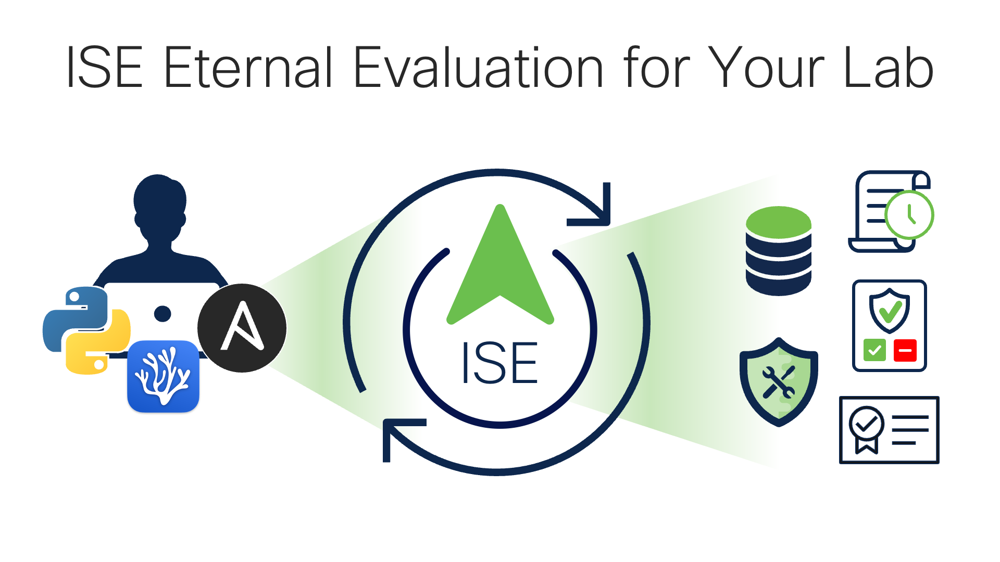

# ISE Ansible Sandbox

Cisco Identity Services Engine (ISE) playbooks and roles for ISE automated deployment and configuration in labs and demos featured in the [Cisco ISE Webinar](https://cs.co/ise-webinars), [ISE Eternal Evaluation for Your Lab](https://youtu.be/xoTwxIDux8Y).
[](https://youtu.be/xoTwxIDux8Y)

## Quick Start

1. Clone this repository:  

   ```sh
   git clone https://github.com/1homas/ISE_Ansible_Sandbox.git
   ```

1. Install a local Python virtual environment with Ansible and other required packages:  

    ```sh
    python_environment_install.sh
    ```

    > ⚠ Installing Ansible using Linux packages (`sudo apt install ansible`) may info in a much older version of Ansible being installed.
    > 💡 Installing Ansible with Python packages will get you the latest.
    > 💡 If you have any problems installing Python or Ansible, see [Installing Ansible](https://docs.ansible.com/ansible/latest/installation_guide/intro_installation.html).

1. Launch your virtual Python environment view your installed Python packages:

    ```sh
    pipenv shell    # virtual Python environment 
    pip list        # view installed Python packages
    ```

1. Export your ISE credentials into your terminal shell environment:  

    ```sh
    export ISE_USERNAME=admin           # 💡 ISE 3.2+ cloud instances use `iseadmin`
    export ISE_PASSWORD=ISEisC00L

    # ISE AAA Pre-Shared Keys
    export ISE_RADIUS_SECRET=ISEisC00L
    export ISE_TACACS_SECRET=ISEisC00L

    # Optional variables for the cisco.ise Ansible modules
    # export ISE_VERIFY=False # optional, defaults to True
    # export ISE_VERSION=3.1_Patch_1 # optional, defaults to 3.1_Patch_1
    # export ISE_WAIT_ON_RATE_LIMIT=True # optional, defaults to True
    # export ISE_USES_API_GATEWAY=True # optional, defaults to True
    # export ISE_DEBUG=False # optional, defaults to False
    ```

    or you may edit and `source` these variables from one or more files in your `~/.secrets` directory :

    ```sh
    source ~/.secrets/aws.sh
    source ~/.secrets/iseee.sh
    source ~/.secrets/ise_dcloud.sh
    source ~/.secrets/ise_repository.sh
    ```

    > 💡 The cisco.ise Ansible modules will automatically use the `ISE_USERNAME`, `ISE_PASSWORD` and `ISE_VERIFY` variables so you do not need to reference them in your tasks!
    > 💡 Add one or more spaces before the `export` commands to prevent these commands with your secrets from being saved to your shell history

1. If you plan to use SSH keys for communicating with ISE or other servers, generate your local SSH key per `project_name`:

    ```sh
    ansible-playbook ssh_key_local.yaml
    ```

1. Edit the Ansible `inventory` directory to align with your ISE environment:

    1. If you are using a static Ansible inventory file (`ise.yaml`), edit the file to specify the static IP address of your ISE node(s).
    1. Rename the respective inventory filenames with or without a prefixed `.` to be excluded (`.` prefix) or included (no `.` prefix) by the Ansible inventory. If you are not sure, just use the static `ise.yaml` file be default.
    1. Rename the respective `inventory/group_vars/` filenames with or without a prefixed `.` for in/exclusion.

## ISE Eternal Evaluation (ISEEE)

The ISE Eternal Evaluation (ISEEE) is meant to showcase many of the ISE application lifecycle operations using REST APIs and automation in a lab or proof of concept environment.

1. Edit the `project_name` in `vars/iseee.yaml` to your desired name - it will be used to tag any cloud resources:

    ```yaml
    project_name: iseee # used for tagging all VPCs and resources
    stage: demo # ['demo','test','staging','production']
    ```

### `iseee.yaml`

```sh
ansible-playbook iseee.yaml
ansible-playbook iseee.yaml --ask-pass  # Use `--ask-pass` option for SSH key password
ansible-playbook iseee.yaml -v          # 💡 verbosity == 1 to show all task output automatically
ansible-playbook iseee.yaml --tags ssh --ask-pass
ansible-playbook iseee.yaml --tags provision
ansible-playbook iseee.yaml --tags deploy
ansible-playbook iseee.yaml --tags licensing
ansible-playbook iseee.yaml --tags password_reset --ask-pass # Use `--ask-pass` option for SSH key password
ansible-playbook iseee.yaml --tags facts
ansible-playbook iseee.yaml --tags patch
ansible-playbook iseee.yaml --tags certificates
ansible-playbook iseee.yaml --tags configure
ansible-playbook iseee.yaml --tags backup
ansible-playbook iseee.yaml --tags restore
ansible-playbook iseee.yaml --tags extend
ansible-playbook iseee.yaml --tags destroy
```

## dCloud

Ansible playbooks for use with labs in **[Cisco dCloud](https://dCloud.cisco.com)**.

1. Review and customize the resources and variables in `inventory/dcloud_ise_sandbox.yaml` and the global dCloud variables in `vars/dcloud.yaml` to match your dCloud lab:

1. Review and edit the Ansible playbook `dcloud.ise_sandbox_deploy.yaml` by un/commenting the roles and tasks you want to execute.

1. Initialize the ISE sandbox instance with the Ansible playbook `dcloud.ise_sandbox_deploy.yaml` :

    ```sh
    ansible-playbook dcloud.ise_sandbox_deploy.yaml
    ```

## `ise_config.yaml`

> 💡 Use `-v` option for verbosity level 1 to show all task output automatically for any Ansible playbook!

```sh
ansible-playbook ise_config.yaml
ansible-playbook ise_config.yaml -v
ansible-playbook ise_config.yaml --tags endpoint_groups
ansible-playbook ise_config.yaml --tags show,endpoint_groups
ansible-playbook ise_config.yaml --tags save,endpoint_groups
ansible-playbook ise_config.yaml --tags save
```

## License

This repository is licensed under the [MIT License](https://choosealicense.com/licenses/mit/).
